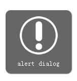

jquery.alert
============

A simple jQuery "alert" message plugin. You can view the example page [here](http://htmlpreview.github.com/?https://github.com/feexon/jquery.alert/blob/master/demo/jquery.alert.html).

##Screenshots



## Required Files
``` html
    <link type="text/css" rel="stylesheet" href="css/jquery.alert.css"/>
    <script type="text/javascript" src="jquery.js"></script>
    <script type="text/javascript" src="dist/jquery.alert.js"></script>
```


## Usage
- simple alert
``` javascript
    $.alert('message', options);
```

- alert sticky dialog
``` javascript
    $.alert('message', {sticky: true})
```
- alert modal dialog
``` javascript
    $.alert('message', {cancellable: false})
```
- alert/loading dialog
``` javascript
    $.alert('message','info')
    $.alert('message','loading')
    $.alert.load('message',options)
```


## Options

Options include alert type, duration, sticky and cancellable.

* **type** - Determines visual style for alert dialog. Values can be any valid css class name (allowing you to define your own dialog styles) or any of the following:'info', 'loading'(default is 'info')
* **duration** - Length of time in milliseconds a non-sticky alert dialog will be displayed. (default: 2000)
* **sticky** - Determines if alert dialog is sticky or not. (default: false)
* **cancellable** - Determines whether is a modal dialog. (default: true)


